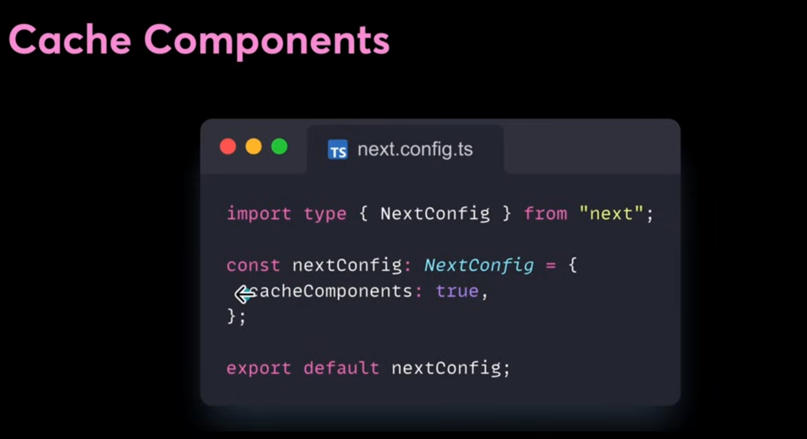
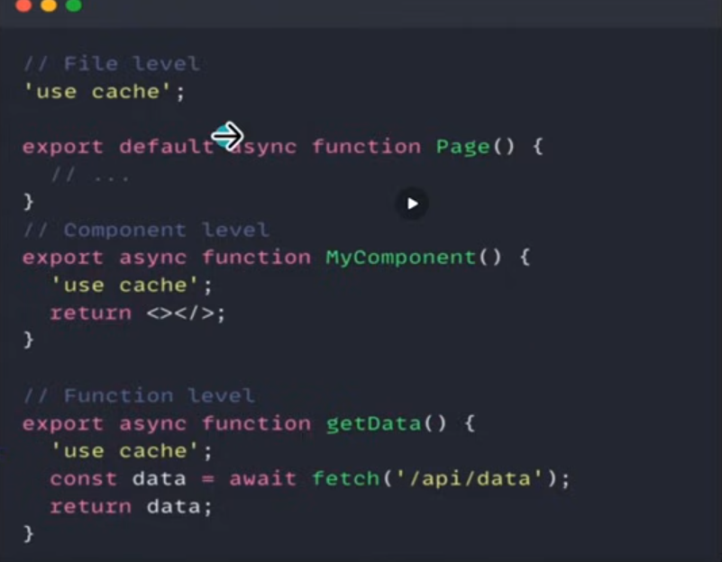
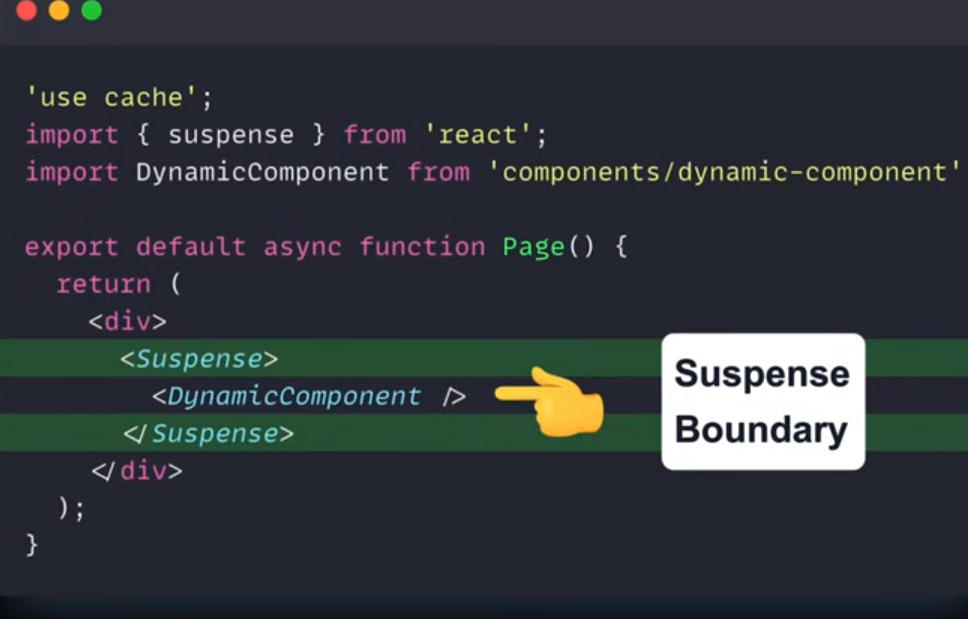
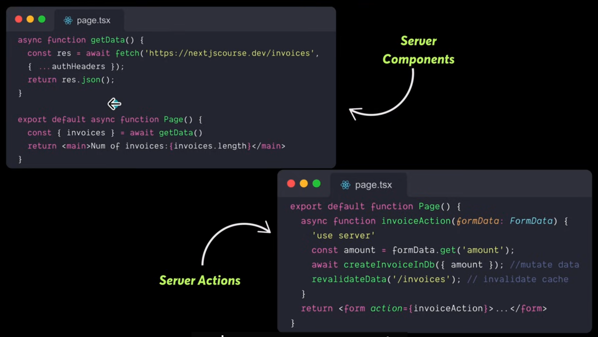

## ⚡ Features

### 🛠️ Core Technologies:

- 🚀 Next.js 16 App Router for server-side rendering, routing, and API endpoints with Server Components

- ⚛️ React 19 for building interactive user interfaces with reusable components

- 🔑 Clerk for secure authentication with Passkeys, Github, and Google Sign-in

- 🎨 ShadcN UI for accessible, customizable React components

- 💾 NeonDB (PostgreSQL) for serverless database storage of products and user data

- 🗄️ Drizzle ORM for type-safe database queries and migrations

- 📜 TypeScript for static typing and enhanced development experience

- 💅 TailwindCSS 4 for utility-first, responsive styling

- ✅ Zod for schema validation and form handling

- 🎯 React Hook Form for efficient form management

### 💫 Application Features:

- 📝 Product submission with validation and moderation

- 🎨 Beautiful, interactive product cards and layouts

- 🔒 Secure file handling and processing

- 🔐 Protected routes and API endpoints

- 👨‍💼 Admin panel for product management and moderation

- 📊 Featured products and recently launched sections

- 📱 Responsive design for mobile and desktop

- 🔄 Real-time updates and path revalidation

- 🚀 Production-ready deployment

- 🔔 Toast notifications for submission status, updates, and error handling

- 📈 Performance optimizations

- 🔍 SEO-friendly product pages

- 🗳️ Voting system for community engagement

- 🏷️ Tag-based product categorization

server and client components
default-> server components
client component-> like button [interactive pieces]

server components:
by default-> server components
don't re-render
not included in Browser Bundle 
RSC stream
can't pass a fn as prop
No Browser API's

client components:
directive 'use client'
can re-render
in browser bundle
Lifecycle hooks are allowed
cannot have RSC as a child
Browser API's are allowed

data fetching:
Nextjs has extended fetch
3 types of fetching->
1. Static site Generation[cache your entire data by using a property called as cache: force cache]
2. Incremental static Regeneration[next:{revalidate:3600} you could say how long you want data to be cached]
3. Server Side Rendering [no caching, fetches everytime]

Rendering spectrum in nextjs:

static: pre-built and cached forever
dynamic: rendered per request
Revalidated: rebuilt periodically
Streaming: progressively streamed chunks

named routes:
app->products->page.tsx[route created]
localhost:3000/products

dynamic routing:
app->products->[id]->page.tsx[route created]

page.tsx:
const page = async({params}:{params: Promise<{id:string}>}) => {

    const {id}=await params;
  return (
    
Product {id}

  )
}

export default page;

localhost:3000/products/3[dynamically changes]

Cache components and Partial Pre-Rendering:

if you add this property: cacheComponents: true in nextconfig
you could cache components at different levels
page level,component level or function level.

depending on the directive 'se cache' you could cache anything you like inside of nextjs.

Partial Pre-rendering:
its huge.
when cache components enabled get partial pre-rendering by default.
pre -render static content
dynamic content is ready to streamed in it automatically shown to you.

anytime you want to cache data -> use cache directive
anytime you want to mark the data to be partially pre rendered-> 
wrap it inside a suspense boundary.

Server actions used for mutation.

'use server' directive mark as server action,which means its internally going to expose a http endpoint 
and you will be able to mutate the data. No need to create api routes, just mark function or file as your server.

server components vs actions:

server components as fetching data
server actions as mutating data.

clerk middleware->app

https://orm.drizzle.team/docs/get-started/neon-new
<!-- 1:32:00 -->